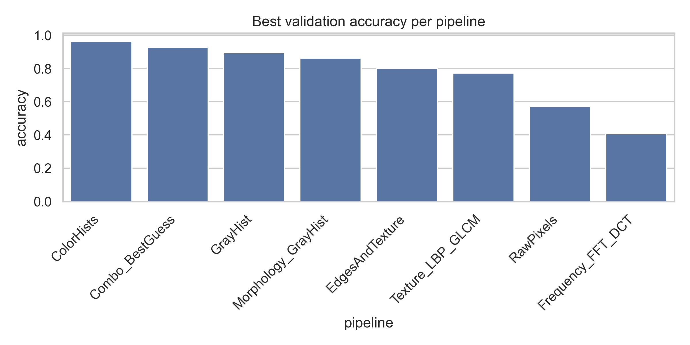

# Blood Cell Image Classification with KNN and Handcrafted Features


## Project overview

This project classifies blood cell images into four classes using classical image-processing features and a K-Nearest Neighbors classifier. The main goal is to compare several handcrafted feature pipelines, evaluate their performance, and study how robust the best pipeline is under image noise, brightness changes, and different training-set sizes.

The project avoids deep learning and focuses on interpretable computer-vision features such as color histograms, grayscale histograms, texture descriptors, edge descriptors, frequency-domain descriptors, and morphology-based descriptors.

## Dataset


The dataset used in this project is the Kaggle Blood Cells dataset listed in [`dataset_link.txt`](dataset_link.txt):

```text
https://www.kaggle.com/datasets/paultimothymooney/blood-cells
```

The dataset contains four blood-cell classes used in this project:

- `EOSINOPHIL`
- `LYMPHOCYTE`
- `MONOCYTE`
- `NEUTROPHIL`

In the completed experiment, the dataset scan found **12,444 images**. The project created a stratified split:

| Split | Number of images |
|---|---:|
| Train | 7,466 |
| Validation | 2,489 |
| Test | 2,489 |

The raw image dataset is not included in this repository because it is large. Download it from Kaggle and place it under `data/raw/` before running the notebooks.

## Main features

- Data loading and train/validation/test split creation
- Exploratory data analysis and class distribution visualization
- Image preprocessing with resizing, grayscale conversion, Gaussian filtering, CLAHE, and other transformations
- Handcrafted feature extraction pipelines:
  - Raw grayscale pixels
  - Grayscale histograms
  - RGB and HSV color histograms
  - LBP and GLCM texture features
  - Sobel edge histogram with texture features
  - FFT and DCT frequency features
  - Morphological shape features
  - Combined feature pipeline
- Custom KNN classifier implemented from scratch in `src/knn.py`
- Optional comparison wrapper around `sklearn.neighbors.KNeighborsClassifier`
- Pipeline comparison across multiple `k` values
- Robustness experiments with Gaussian noise, salt-and-pepper noise, and brightness changes
- Training-size sensitivity analysis
- PCA and t-SNE visualization notebooks

## Results summary

The best validation result came from the **ColorHists** pipeline using **k = 1**.

| Rank | Pipeline | Best k | Validation accuracy | Validation macro F1 |
|---:|---|---:|---:|---:|
| 1 | ColorHists | 1 | 0.9642 | 0.9641 |
| 2 | Combo_BestGuess | 3 | 0.9289 | 0.9283 |
| 3 | GrayHist | 3 | 0.8947 | 0.8934 |
| 4 | Morphology_GrayHist | 1 | 0.8618 | 0.8599 |
| 5 | EdgesAndTexture | 3 | 0.7995 | 0.7952 |
| 6 | Texture_LBP_GLCM | 1 | 0.7726 | 0.7682 |
| 7 | RawPixels | 1 | 0.5717 | 0.5690 |
| 8 | Frequency_FFT_DCT | 1 | 0.4066 | 0.4064 |

When the best validation configuration was evaluated on the test set, it achieved approximately:

| Metric | Test score |
|---|---:|
| Accuracy | 0.9699 |
| Macro precision | 0.9699 |
| Macro recall | 0.9699 |
| Macro F1 | 0.9699 |

The experiments also showed that the color-histogram KNN model performs well on clean data, but its accuracy drops significantly under strong artificial noise and brightness changes. This suggests that the model is effective for clean blood-cell images but not fully robust to image corruption or acquisition changes.



## Project structure

```text
blood-cell-knn-classification/
├── dataset_link.txt
├── requirements.txt
├── README.md
├── .gitignore
├── src/
│   ├── __init__.py
│   ├── config.py
│   ├── data_loading.py
│   ├── evaluation.py
│   ├── features.py
│   ├── filters.py
│   ├── knn.py
│   ├── pipelines.py
│   ├── preprocessing.py
│   ├── utils.py
│   └── visualization.py
├── notebooks/
│   ├── setup_files.ipynb
│   ├── dataset_and_EDA.ipynb
│   ├── preprocessing_and_filters.ipynb
│   ├── feature_extraction.ipynb
│   ├── knn_training_baselines.ipynb
│   ├── knn_advanced_experiments.ipynb
│   ├── robustness_and_sensitivity_analysis.ipynb
│   ├── results_and_figures.ipynb
│   ├── visualization_pca_tsne.ipynb
│   └── knn_decision_boundaries.ipynb
├── experiments/
│   └── results/
│       ├── per_pipeline_val_results.csv
│       ├── robustness_brightness.csv
│       ├── robustness_gaussian_noise.csv
│       ├── robustness_salt_pepper.csv
│       └── sensitivity_train_size.csv
└── reports/
    ├── figures/
    │   └── best_validation_accuracy_per_pipeline.png
    └── tables/
        └── best_validation_per_pipeline.csv
```

## Installation

Clone the repository:

```bash
git clone https://github.com/<your-username>/blood-cell-knn-classification.git
cd blood-cell-knn-classification
```

Create and activate a virtual environment:

```bash
python -m venv .venv
```

On Windows:

```bash
.venv\Scripts\activate
```

On macOS/Linux:

```bash
source .venv/bin/activate
```

Install dependencies:

```bash
pip install -r requirements.txt
```

## Dataset setup

1. Download the dataset from the Kaggle link in [`dataset_link.txt`](dataset_link.txt).
2. Extract the dataset into the project folder under:

```text
data/raw/
```

The code scans image files recursively, so the important point is that the blood-cell class folders such as `EOSINOPHIL`, `LYMPHOCYTE`, `MONOCYTE`, and `NEUTROPHIL` are inside the `data/raw/` directory somewhere in the folder tree.

## How to run the project

Run the notebooks in this order:

1. `notebooks/setup_files.ipynb`
2. `notebooks/dataset_and_EDA.ipynb`
3. `notebooks/preprocessing_and_filters.ipynb`
4. `notebooks/feature_extraction.ipynb`
5. `notebooks/knn_training_baselines.ipynb`
6. `notebooks/knn_advanced_experiments.ipynb`
7. `notebooks/robustness_and_sensitivity_analysis.ipynb`
8. `notebooks/results_and_figures.ipynb`
9. `notebooks/visualization_pca_tsne.ipynb`
10. `notebooks/knn_decision_boundaries.ipynb`

The most important notebooks for reproducing the final results are:

- `dataset_and_EDA.ipynb`
- `feature_extraction.ipynb`
- `knn_advanced_experiments.ipynb`
- `robustness_and_sensitivity_analysis.ipynb`
- `results_and_figures.ipynb`

## Feature pipelines

The feature pipelines are defined in `src/pipelines.py`.

| Pipeline | Description |
|---|---|
| `RawPixels` | Raw grayscale pixel values |
| `GrayHist` | Grayscale intensity histogram |
| `ColorHists` | RGB and HSV color histograms |
| `Texture_LBP_GLCM` | Texture features from LBP and GLCM |
| `EdgesAndTexture` | Sobel edge histogram with LBP texture |
| `Frequency_FFT_DCT` | FFT radial energy and DCT low-frequency block |
| `Morphology_GrayHist` | Morphological shape features with grayscale histogram |
| `Combo_BestGuess` | Combined grayscale histogram, LBP, Sobel, and FFT radial features |

## Files to upload to GitHub

Upload these files and folders:

```text
README.md
requirements.txt
.gitignore
dataset_link.txt
src/
notebooks/
experiments/results/
reports/figures/
reports/tables/
```

Do **not** upload these large or machine-specific files/folders:

```text
data/raw/
data/interim/
data/processed/features/
data/processed/images/
.ipynb_checkpoints/
__pycache__/
.venv/
*.npz
*.npy
*.pkl
```

The repository should contain the code, notebooks, saved result CSV files, and selected figures. The raw dataset and generated feature arrays should be recreated locally by following the setup steps.

## Recommended visuals for the README

This README already includes the saved validation-accuracy figure:

```markdown

```

Good additional visuals to save into `reports/figures/` and add later:

- Sample images from each blood-cell class
- Confusion matrix for the best model
- PCA or t-SNE plot of the best feature pipeline
- Accuracy vs. `k` line plot
- Robustness plots for Gaussian noise, salt-and-pepper noise, and brightness changes
- Training-size sensitivity curve

## Important note for portability

The GitHub-ready version of `src/config.py` should avoid hard-coded local paths such as:

```python
PROJECT_ROOT = r"C:\Users\Arafat\Desktop\IMA Project"
```

Instead, use a dynamic project root based on the location of `config.py`, so the project works after cloning on another computer.

## Author

Arafat Islam

## License

No license has been selected yet. If this is a public academic/project portfolio repository, consider adding an MIT License or another open-source license that matches how you want others to use the code.
